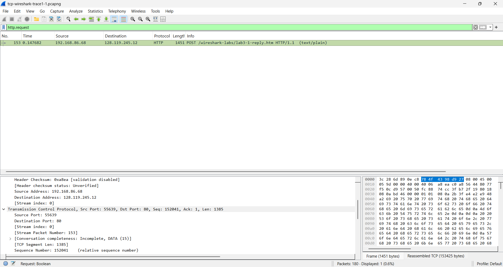
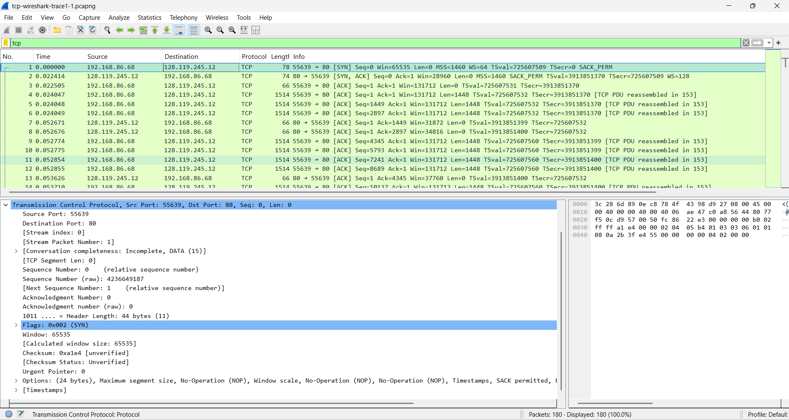
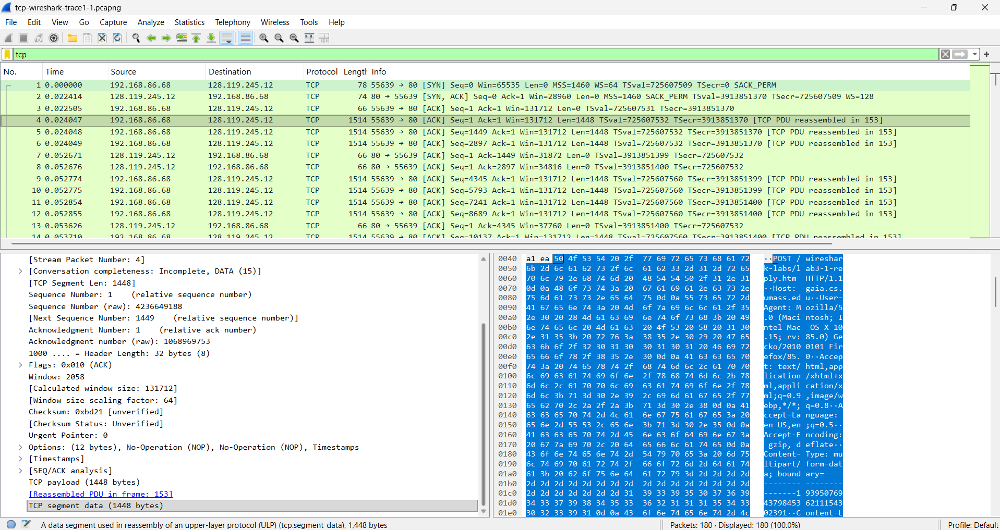
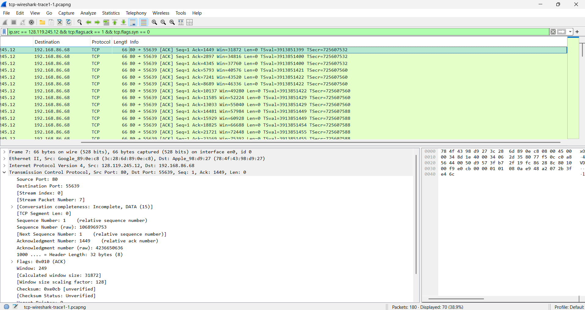
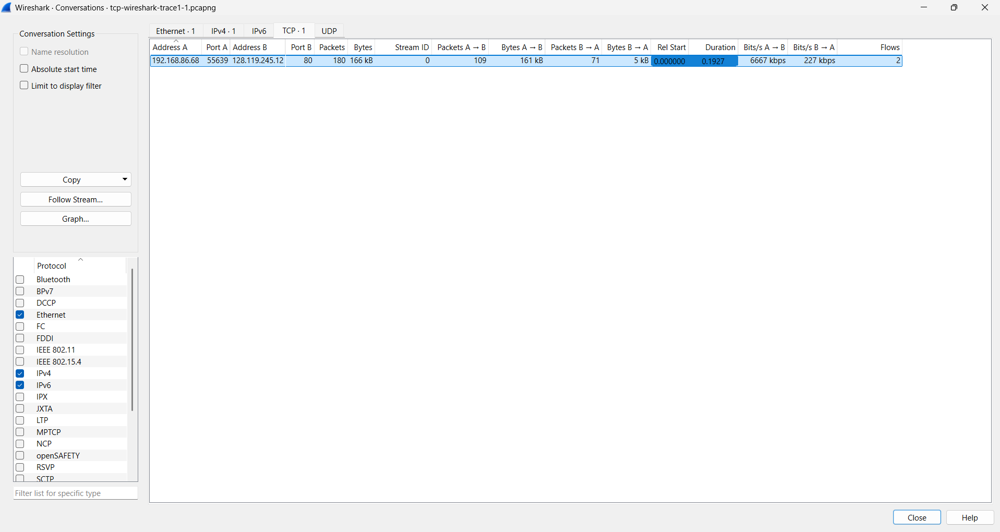

# Wireshark TCP Protocol Analysis

A hands-on analysis of TCP behavior using Wireshark, focused on connection establishment, sequence and acknowledgment numbers, HTTP segmentation, round-trip time, receiver flow control, retransmissions, throughput, and congestion control.

This project was developed as part of **CNT 4713 – Net-Centric Computing** at **Florida International University** and has been documented as a technical portfolio project to demonstrate practical network protocol analysis skills.

---

## Overview

This project analyzes a TCP connection used to transfer an approximately 150 KB text file to the `gaia.cs.umass.edu` web server through an HTTP POST request.

Using Wireshark, I inspected the connection at the packet level to understand how TCP provides reliable, flow-controlled, and congestion-aware communication.

The analysis covers:

- TCP three-way handshake
- TCP flags and options
- Sequence and acknowledgment numbers
- Selective Acknowledgment support
- HTTP POST segmentation
- TCP payload inspection
- Round-Trip Time (RTT)
- Estimated RTT
- Receiver-advertised flow control
- TCP window scaling
- Retransmission behavior
- TCP acknowledgment patterns
- Throughput measurement
- TCP slow start and congestion control

---

## Tools and Technologies

- **Wireshark**
- **HTTP**
- **Packet Capture Analysis**
- **TCP Stream Analysis**
- **TCP Time-Sequence Graphs**

---

## Network Flow

The analyzed TCP connection was established between:

| Role | IP Address | TCP Port |
|---|---|---:|
| Client | `192.168.86.68` | `55639` |
| Server | `128.119.245.12` | `80` |

The client used ephemeral TCP port `55639`, while the remote HTTP server communicated over TCP port `80`.

```text
Client
192.168.86.68:55639
        |
        | TCP / HTTP
        v
gaia.cs.umass.edu
128.119.245.12:80
```

### Packet-Level Endpoint Verification



*Wireshark inspection of the HTTP POST connection showing the client `192.168.86.68:55639` communicating with `gaia.cs.umass.edu` at `128.119.245.12:80`.*

---

## TCP Three-Way Handshake

The connection begins with the standard TCP three-way handshake:

```text
Client                                  Server

      SYN
      ---------------------------------->

                     SYN, ACK
      <----------------------------------

      ACK
      ---------------------------------->
```
### Handshake Capture



*Initial TCP connection establishment showing the SYN, SYN-ACK, and ACK exchange between the client and server.*

### Client SYN

The client initiated the connection using:

```text
Raw Sequence Number: 4236649187
Flags: SYN
```

The SYN also advertised:

```text
SACK_PERM
```

indicating that **Selective Acknowledgment (SACK)** was supported for the connection.

### Server SYN-ACK

The server responded with:

```text
Raw Sequence Number:       1068969752
Raw Acknowledgment Number: 4236649188
Flags: SYN, ACK
```

The acknowledgment value is:

```text
4236649187 + 1 = 4236649188
```

because a TCP SYN consumes one sequence number.

---

## Sequence and Acknowledgment Analysis

TCP sequence numbers identify positions within the transmitted byte stream rather than packet numbers.

The client's SYN began with:

```text
4236649187
```

The first application-data byte therefore began at:

```text
4236649188
```

The server's acknowledgment number indicates the **next byte expected** from the client.

This behavior illustrates TCP's byte-oriented reliability mechanism.

---

## HTTP POST Segmentation

The uploaded file was too large to fit inside a single TCP segment, so the application-layer HTTP POST message was divided across many TCP segments.

An important observation from this analysis was the distinction between:

- the TCP segment containing the **beginning** of the HTTP request, and
- the packet Wireshark associates with the **fully reassembled** HTTP POST message.

The first segment containing the HTTP POST header was:

```text
Packet 4
```

Inspection of the TCP payload showed:

```text
50 4f 53 54
```

which corresponds to the ASCII characters:

```text
P  O  S  T
```

This directly verified that packet 4 contained the beginning of the HTTP POST request.

### Raw Payload Verification



*Inspection of the first data-carrying TCP segment. The hexadecimal bytes `50 4f 53 54` correspond to the ASCII string `POST`, confirming the beginning of the HTTP request directly within the TCP payload.*

---

## TCP Segment Structure

The initial data-carrying TCP segments contained:

```text
TCP Payload: 1448 bytes
TCP Header:    32 bytes
```

Therefore:

```text
TCP header + payload = 1480 bytes
```

Adding the IPv4 header:

```text
IPv4 Header: 20 bytes
```

produced a complete:

```text
1500-byte IPv4 packet
```

| Component | Size |
|---|---:|
| TCP Payload | `1448 bytes` |
| TCP Header | `32 bytes` |
| TCP Header + Payload | `1480 bytes` |
| IPv4 Header | `20 bytes` |
| IPv4 Packet | `1500 bytes` |

This distinction is useful because Wireshark's displayed TCP `Len` value represents the TCP payload length rather than the TCP header plus payload.

---

## Round-Trip Time Analysis

Round-Trip Time measures how long it takes for transmitted TCP data to reach the receiver and for the corresponding acknowledgment to return.

### First Data Segment

```text
Segment sent:  0.024047 s
ACK received:  0.052671 s
```

Therefore:

```text
RTT = 0.052671 - 0.024047
    = 0.028624 s
```

or:

```text
28.624 ms
```

### Second Data Segment

```text
Segment sent:  0.024048 s
ACK received:  0.052676 s
```

Therefore:

```text
RTT = 0.052676 - 0.024048
    = 0.028628 s
```

or:

```text
28.628 ms
```

---

## Estimated RTT

Using:

```text
α = 0.125
```

and the exponentially weighted moving average:

```text
EstimatedRTT =
(1 - α)(Previous EstimatedRTT)
+ α(SampleRTT)
```

the updated estimate after the second RTT sample was:

```text
EstimatedRTT
= (0.875)(0.028624)
+ (0.125)(0.028628)

= 0.0286245 s
```

or approximately:

```text
28.6245 ms
```

---

## TCP Receiver Flow Control

TCP uses the receiver-advertised window to prevent a sender from overwhelming the receiver's available buffer space.

The analyzed connection negotiated a TCP Window Scaling Factor of:

```text
128
```

Initial server acknowledgments advertised:

| ACK | Window Size Value | Scale Factor | Effective Window |
|---:|---:|---:|---:|
| `1449` | `249` | `128` | `31,872 bytes` |
| `2897` | `272` | `128` | `34,816 bytes` |
| `4345` | `295` | `128` | `37,760 bytes` |
| `5793` | `317` | `128` | `40,576 bytes` |

### Receiver-Advertised Window



*Wireshark TCP header analysis showing a raw Window Size Value of `249`, a Window Scaling Factor of `128`, and an effective advertised receive window of `31,872 bytes`.*

The smallest observed raw window value was:

```text
249
```

which corresponds to:

```text
249 × 128 = 31,872 bytes
```

The available receiver buffer was therefore large enough that receiver-side flow control did not throttle the sender during the initial portion of the transfer.

---

## TCP Acknowledgment Behavior

The initial TCP data segments carried:

```text
1448 bytes
```

of payload each.

Observed acknowledgment numbers included:

```text
1449
2897
4345
5793
```

The difference between consecutive ACK values was:

```text
1448 bytes
```

demonstrating TCP's cumulative, byte-oriented acknowledgment mechanism.

---

## Retransmission Analysis

No TCP retransmissions were observed during the analyzed transfer.

One Wireshark filter used to investigate retransmission behavior was:

```text
tcp.analysis.retransmission || tcp.analysis.fast_retransmission
```

I also examined the client-to-server TCP sequence-number progression for repeated or overlapping data ranges.

The sequence numbers continued advancing without evidence that previously transmitted payload had been sent again.

---

## Throughput Analysis

Throughput depends on both the traffic being measured and the time interval selected.

Wireshark's TCP conversation statistics reported approximately:

```text
6.667 Mb/s
```

for the complete client-to-server conversation interval.

### TCP Conversation Statistics



*Wireshark TCP conversation statistics for the client-server session, including packet counts, transferred bytes, connection duration, and directional throughput.*

A separate application-data calculation used:

```text
Throughput = Data Transferred / Transfer Time
```

Using approximately:

```text
153425 bytes
```

over:

```text
0.147682 - 0.024047
= 0.123635 s
```

produces:

```text
≈ 1.24 MB/s
```

or approximately:

```text
≈ 9.9 Mb/s
```

The difference between these measurements demonstrates an important networking principle:

> A throughput result should always be interpreted together with the traffic scope and measurement interval used to calculate it.

---

## TCP Congestion Control

Wireshark's **Time-Sequence Graph (Stevens)** was used to visualize TCP sequence numbers over time.

During the beginning of the transfer, groups of TCP segments appeared around:

```text
t ≈ 0.025 s
t ≈ 0.053 s
t ≈ 0.082 s
t ≈ 0.100 s
```

The approximate fleet sizes followed:

```text
3 → 6 → 12 → 24
```

This rapidly increasing transmission pattern is consistent with **TCP Slow Start**.

During slow start, acknowledgments allow the congestion window to increase quickly, enabling progressively larger groups of segments to be transmitted.

The spacing between these packet fleets was also approximately related to the connection's RTT.

### Time-Sequence Analysis


*Wireshark Time-Sequence Graph (Stevens) for the client-to-server direction. Increasing groups of transmitted TCP segments during the early transfer illustrate behavior consistent with TCP Slow Start.*

---

## Key Findings

Through this analysis, I observed that:

- TCP established the connection using the standard `SYN → SYN-ACK → ACK` handshake.
- TCP sequence numbers represent byte positions rather than packet identifiers.
- SYN segments consume one sequence number.
- Selective Acknowledgment support was negotiated during connection establishment.
- Large HTTP messages can span many TCP segments.
- Wireshark can reassemble application-layer messages from multiple TCP segments.
- Direct hexadecimal payload inspection can verify application-layer content inside individual TCP segments.
- Initial TCP payloads contained `1448 bytes`.
- Measured RTT was approximately `28.6 ms`.
- TCP window scaling expanded the receiver's advertised buffer capacity.
- Receiver buffer availability did not initially throttle the sender.
- No retransmissions were observed.
- TCP acknowledgments advanced according to the number of successfully received bytes.
- TCP slow start was visible through increasingly large fleets of transmitted segments.
- Throughput values can differ depending on measurement scope and methodology.

---

## Skills Demonstrated

This project demonstrates practical experience with:

- Wireshark packet analysis
- TCP three-way handshake analysis
- TCP flags and options
- Sequence and acknowledgment numbers
- TCP payload inspection
- Application-layer reassembly
- RTT measurement
- Estimated RTT calculations
- TCP flow control
- Receiver-advertised windows
- TCP window scaling
- Retransmission analysis
- TCP throughput analysis
- TCP congestion control
- TCP Slow Start
- Time-Sequence Graph analysis
- Network troubleshooting methodology

---

For more detailed measurements and technical notes, see:

[`notes/observations.md`](notes/observations.md)

---

## Academic Context

This project originated from coursework completed for:

**CNT 4713 – Net-Centric Computing**  
**Florida International University**

The packet trace analyzed in this project is associated with the Wireshark TCP lab accompanying *Computer Networking: A Top-Down Approach*.

This repository contains my own:

- Packet analysis
- Technical observations
- Calculations
- Interpretations
- Documentation
